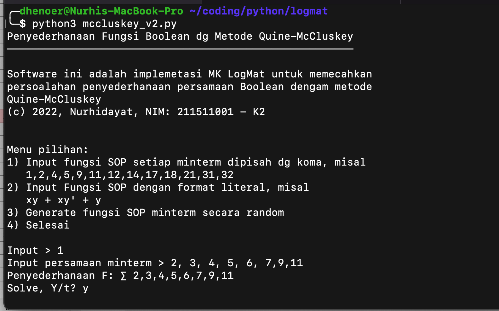
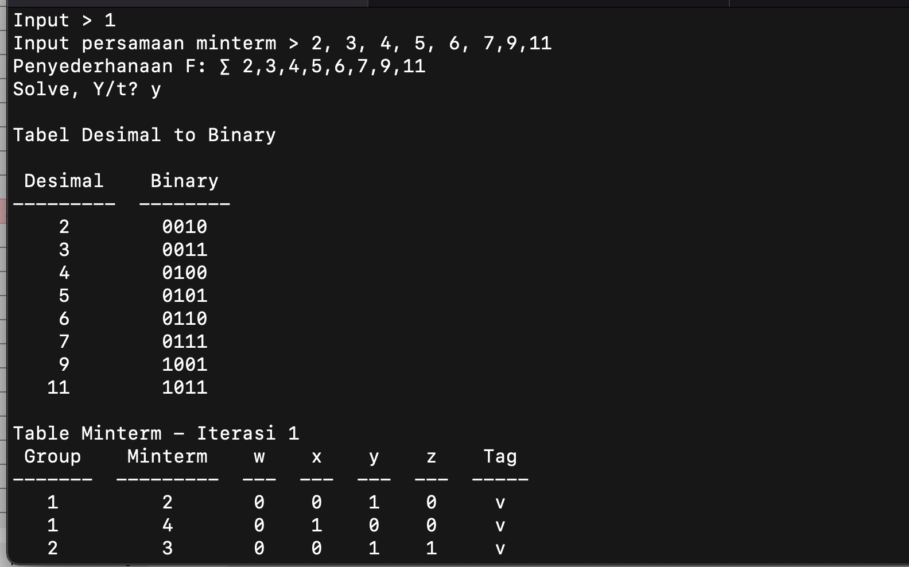
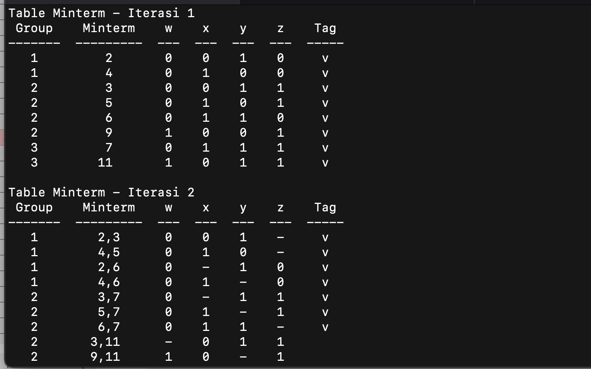
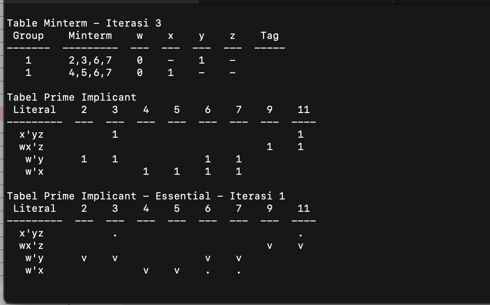
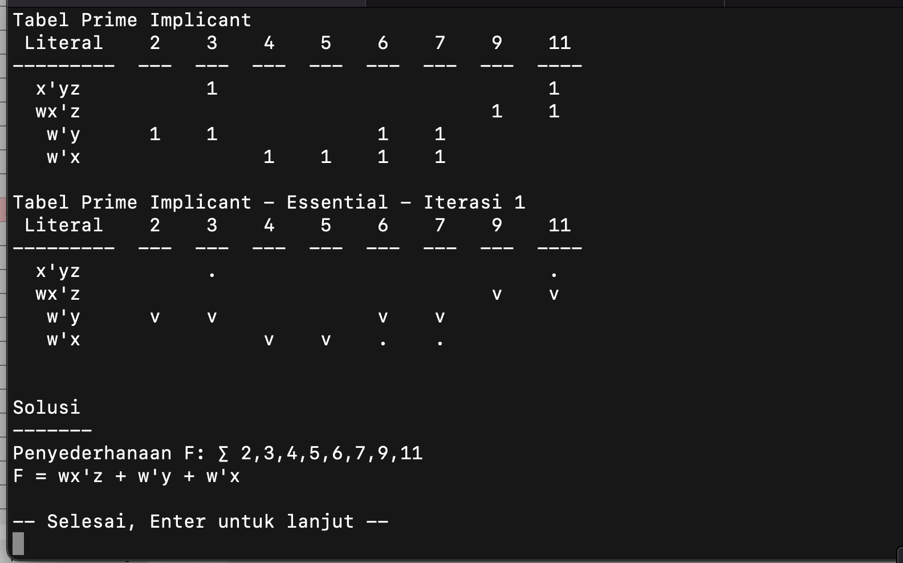
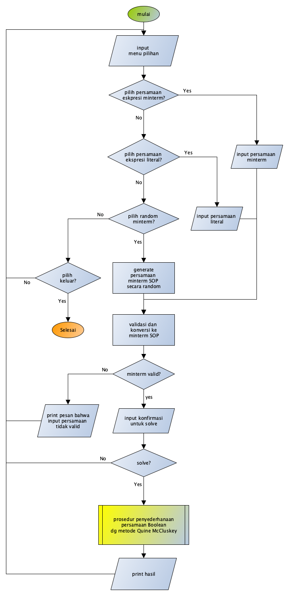
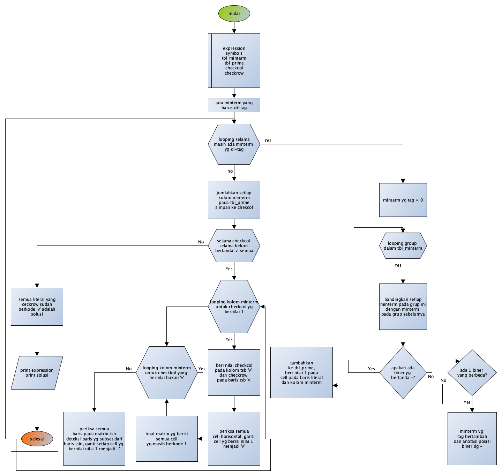

# Penyederhanaan Fungsi Boolean dg Metode Quine-McCluskey

Software ini adalah implemetasi MK LogMat untuk memecahkan
persoalahan penyederhanaan persamaan Boolean dengam metode
Quine-McCluskey

(c) 2022, Nurhidayat, NIM: 211511001 - K2

## Spesifikasi Program

Program dibuat dengan bahasa Python dengan library standard. 
*Source-code* mencapai 730-an baris, termasuk baris-baris 
komentar untuk memudahkan mengingat kembali apa yang dilakukan 
oleh blok baris tersebut.

## Fitur Menu

Menu pilihan yang tersedia pada program ini adalah:

1. Input fungsi SOP setiap minterm dipisah dg koma, misal: `1,2,4,5,9,11,12,14,17,18,21,31,32`
2. Input Fungsi SOP dengan format literal, misal: `xy + xy' + y`
3. Generate fungsi SOP minterm secara random
4. Selesai

Input persamaan minterm dapat format SOP seperti ditampilan dalam contoh permisalan. 
Selain itu user dapat juga menginput persamaan Boolean secara literal, misal `xy + xy' +y'` 
atau `abc + ab + c'`

## Tangkapan Layar

Screenshot Menu

Screenshot Minterm Expression

Screenshot Minterm Expression

Screenshot Prime Implicant

Screenshot Solusi

## Flowchart

Flowchart Main Application

Flowchart Quine Procedure
